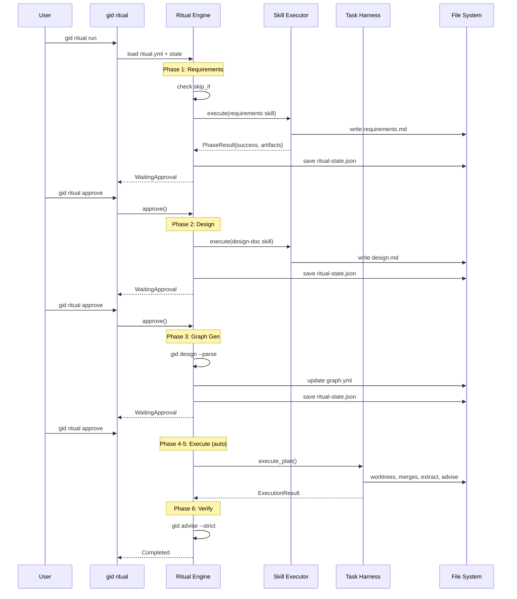

# Design: GID Rituals — End-to-End Development Pipeline Orchestration

## 1. Overview

Rituals are GID's highest-level abstraction: a multi-phase pipeline that orchestrates skills, tools, and the task harness into a complete development workflow — from idea to verified, merged code.

The GID ecosystem has three layers:

```
Layer 3: Rituals   — multi-phase orchestration (this document)
Layer 2: Skills    — prompt + tool usage instructions (requirements, design-doc, etc.)
Layer 1: Tools     — MCP servers, CLI commands, Rust crates (gid, git, cargo, etc.)
```

The task harness (DESIGN-task-harness.md) covers Phase 4-7 execution. Rituals wrap the full Phase 1-7 lifecycle, adding:
- **Phase sequencing** with data flow between phases
- **Approval gates** at configurable points
- **Conditional execution** (skip phases, resume from checkpoint)
- **Per-phase configuration** (model, concurrency, timeouts)
- **Pipeline state** for crash recovery and resumption
- **Template inheritance** for reusable pipeline patterns

### Key difference from n8n-style workflows

Rituals orchestrate **AI agent sessions**, not deterministic API calls. Each phase may involve non-deterministic LLM output, adaptive re-planning, and human-in-the-loop approval. This fundamentally changes error handling, state management, and verification compared to traditional workflow engines.

**Satisfies:** GOAL-6.4, GOAL-6.5, GOAL-6.8, GOAL-6.9, GOAL-6.10

## 2. Architecture

```mermaid
graph TD
    RC[ritual.yml<br>Pipeline Definition] --> RE[Ritual Engine]
    RE --> P1[Phase 1: Idea Intake<br>skill: idea-intake]
    RE --> P2[Phase 2: Requirements<br>skill: requirements]
    RE --> P3[Phase 3: Design<br>skill: design-doc]
    RE --> P4[Phase 4: Graph Gen<br>gid design + parse]
    RE --> P5[Phase 5-6: Execute<br>gid execute<br>task harness]
    RE --> P7[Phase 7: Verify<br>gid advise]
    
    RS[ritual-state.json<br>Pipeline State] <--> RE
    RT[execution-log.jsonl<br>Telemetry] <-- append --- RE
    
    P1 -->|ideas.md| P2
    P2 -->|requirements.md| P3
    P3 -->|design.md| P4
    P4 -->|graph.yml| P5
    P5 -->|merged code| P7
```

The Ritual Engine is a state machine that advances through phases, checking gates between each transition. It delegates actual work to skills (Phase 1-3), gid commands (Phase 4), and the task harness (Phase 5-7).

The engine lives in the `gid-harness` crate alongside the task scheduler, since both are async execution concerns. The `gid-core` crate remains pure planning/analysis.

## 3. Components

### 3.1 Ritual Definition Parser

**Responsibility:** Parse `.gid/ritual.yml` into a `RitualDefinition` struct, resolving template inheritance and validating phase references.

**Interface:**
```rust
/// A ritual definition parsed from ritual.yml
pub struct RitualDefinition {
    pub name: String,
    pub description: Option<String>,
    pub extends: Option<String>,
    pub phases: Vec<PhaseDefinition>,
    pub config: RitualConfig,
}

/// Per-phase configuration
pub struct PhaseDefinition {
    pub id: String,
    pub kind: PhaseKind,
    pub model: Option<String>,
    pub approval: ApprovalRequirement,
    pub skip_if: Option<SkipCondition>,
    pub timeout_minutes: Option<u32>,
    pub input: Vec<ArtifactRef>,
    pub output: Vec<ArtifactSpec>,
    pub hooks: PhaseHooks,
    pub on_failure: FailureStrategy,
}

/// What a phase does
pub enum PhaseKind {
    /// Run a skill (LLM session with skill prompt)
    Skill { name: String },
    /// Run a gid command
    GidCommand { command: String, args: Vec<String> },
    /// Run the task harness (gid execute)
    Harness { config_overrides: Option<HarnessConfig> },
    /// Run an arbitrary shell command
    Shell { command: String },
}

/// When to require approval
pub enum ApprovalRequirement {
    Required,   // Always pause for human approval
    Optional,   // Pause only if configured
    Auto,       // Never pause
}

/// When to skip a phase
pub enum SkipCondition {
    /// Skip if file exists
    FileExists(String),
    /// Skip if a glob pattern matches any files
    GlobMatches(String),
    /// Skip if a previous phase produced a specific artifact
    ArtifactExists(String),
    /// Always skip (useful for template overrides)
    Always,
}

/// How artifacts flow between phases
pub struct ArtifactRef {
    pub from_phase: Option<String>,
    pub path: String,
}

pub struct ArtifactSpec {
    pub path: String,
    pub required: bool,
}

/// Hooks that run at phase boundaries
pub struct PhaseHooks {
    pub pre: Vec<String>,
    pub post: Vec<String>,
}

/// What to do when a phase fails
pub enum FailureStrategy {
    Retry { max_attempts: u32 },
    Escalate,
    Skip,
    Abort,
}

/// Global ritual configuration
pub struct RitualConfig {
    pub default_model: String,
    pub default_approval: ApprovalRequirement,
    pub state_file: String,
    pub log_file: String,
}

impl RitualDefinition {
    /// Parse from a YAML file, resolving `extends` by loading template
    pub fn load(path: &Path, template_dirs: &[PathBuf]) -> Result<Self> { ... }
    
    /// Validate: all phase IDs unique, artifact refs resolve, no cycles in phase ordering
    pub fn validate(&self) -> Result<()> { ... }
}
```

**Key Details:**
- `extends` resolves templates from: (1) `.gid/rituals/`, (2) `~/.gid/rituals/`, (3) skill-bundled templates
- Template resolution is single-level (no chained inheritance) to keep it simple
- Phase ordering is sequential by definition order in YAML — no DAG needed at the ritual level (that's what the task harness is for)
- `skip_if: FileExists` checks relative to project root
- `input`/`output` paths are relative to project root (e.g., `.gid/features/auth/requirements.md`)

**Satisfies:** GOAL-5.7, GOAL-5.8

### 3.2 Ritual Engine

**Responsibility:** Execute a ritual by advancing through phases, managing state transitions, checking approval gates, and delegating work to the appropriate executor (skill runner, gid CLI, task harness).

**Interface:**
```rust
/// Current state of a ritual execution
pub struct RitualState {
    pub ritual_name: String,
    pub started_at: DateTime<Utc>,
    pub current_phase: usize,
    pub phase_states: Vec<PhaseState>,
    pub status: RitualStatus,
}

pub enum RitualStatus {
    Running,
    WaitingApproval { phase_id: String, message: String },
    Paused,
    Completed,
    Failed { phase_id: String, error: String },
    Cancelled,
}

pub struct PhaseState {
    pub phase_id: String,
    pub status: PhaseStatus,
    pub started_at: Option<DateTime<Utc>>,
    pub completed_at: Option<DateTime<Utc>>,
    pub artifacts_produced: Vec<String>,
    pub error: Option<String>,
}

pub enum PhaseStatus {
    Pending,
    Skipped { reason: String },
    Running,
    WaitingApproval,
    Completed,
    Failed,
}

pub struct RitualEngine {
    definition: RitualDefinition,
    state: RitualState,
    gid_root: PathBuf,
}

impl RitualEngine {
    /// Create engine from definition, loading or initializing state
    pub fn new(definition: RitualDefinition, gid_root: &Path) -> Result<Self> { ... }
    
    /// Resume from persisted state (crash recovery)
    pub fn resume(definition: RitualDefinition, gid_root: &Path) -> Result<Self> { ... }
    
    /// Run the ritual from current state to completion (or next approval gate)
    pub async fn run(&mut self) -> Result<RitualStatus> { ... }
    
    /// Approve the current pending phase and continue
    pub async fn approve(&mut self) -> Result<RitualStatus> { ... }
    
    /// Skip the current pending phase
    pub fn skip_current(&mut self) -> Result<()> { ... }
    
    /// Cancel the ritual
    pub fn cancel(&mut self) -> Result<()> { ... }
    
    /// Get current state for display
    pub fn state(&self) -> &RitualState { ... }
}
```

**Key Details:**
- `run()` is the main loop: check skip_if → run pre-hooks → execute phase → run post-hooks → check approval gate → persist state → advance
- State is persisted to `.gid/ritual-state.json` after every phase transition (crash recovery)
- On resume, engine reads state file and skips already-completed phases
- Approval gates: when `approval: Required`, engine sets status to `WaitingApproval` and returns. External caller (CLI, Telegram, gidterm) calls `approve()` to continue.
- Phase execution is synchronous within the ritual (phases run one at a time, sequentially). Parallelism happens *inside* Phase 5-6 via the task harness.
- The engine doesn't directly call LLMs — it delegates to phase executors (§3.3)

**Satisfies:** GOAL-6.4, GOAL-6.5, GOAL-6.6, GOAL-6.7, GOAL-6.8, GOAL-6.9, GOAL-6.10, GOAL-4.6, GOAL-4.7

### 3.3 Phase Executors

**Responsibility:** Execute individual phases by delegating to the appropriate backend: skill runner (LLM session), gid CLI, task harness, or shell.

**Interface:**
```rust
/// Result of executing a single phase
pub struct PhaseResult {
    pub success: bool,
    pub artifacts: Vec<String>,
    pub error: Option<String>,
    pub duration_secs: u64,
}

/// Trait for phase execution backends
#[async_trait]
pub trait PhaseExecutor: Send + Sync {
    async fn execute(
        &self,
        phase: &PhaseDefinition,
        context: &PhaseContext,
    ) -> Result<PhaseResult>;
}

/// Context passed to every phase executor
pub struct PhaseContext {
    pub project_root: PathBuf,
    pub gid_root: PathBuf,
    pub previous_artifacts: HashMap<String, Vec<String>>,
    pub model: String,
    pub ritual_name: String,
    pub phase_index: usize,
}

/// Runs a skill by spawning an LLM session with the skill's prompt
pub struct SkillExecutor {
    pub skills_dir: PathBuf,
    pub auth: Arc<agentctl_auth::AuthPool>,
}

/// Runs a gid CLI command (design, extract, advise, etc.)
pub struct GidCommandExecutor {
    pub gid_binary: PathBuf,
}

/// Runs the task harness (gid execute) — delegates to existing scheduler
pub struct HarnessExecutor {
    pub auth: Arc<agentctl_auth::AuthPool>,
}

/// Runs a shell command
pub struct ShellExecutor;

impl SkillExecutor {
    /// Load skill's SKILL.md, construct system prompt, run LLM session
    pub async fn execute(
        &self,
        phase: &PhaseDefinition,
        context: &PhaseContext,
    ) -> Result<PhaseResult> { ... }
}

impl HarnessExecutor {
    /// Calls existing execute_plan() from gid-harness scheduler
    pub async fn execute(
        &self,
        phase: &PhaseDefinition,
        context: &PhaseContext,
    ) -> Result<PhaseResult> { ... }
}
```

**Key Details:**
- `SkillExecutor` reads `skills/{name}/SKILL.md`, constructs a system prompt including the skill template + input artifacts, and runs an LLM session via `agentctl_auth::claude::Client`
- `GidCommandExecutor` shells out to the `gid` binary (e.g., `gid design --parse`, `gid extract`, `gid advise`)
- `HarnessExecutor` calls into `gid_harness::scheduler::execute_plan()` directly (same process, no CLI overhead)
- `ShellExecutor` runs arbitrary commands via `tokio::process::Command`
- All executors check output artifacts exist after execution; missing required artifacts → phase failure
- Auth pool is shared across skill executor and harness executor for token rotation

**Satisfies:** GOAL-7.1, GOAL-7.2, GOAL-7.3, GOAL-7.4, GOAL-7.5, GOAL-5.4

### 3.4 Artifact Manager

**Responsibility:** Track artifacts (files) produced by each phase, verify they exist, and resolve artifact references between phases.

**Interface:**
```rust
pub struct ArtifactManager {
    project_root: PathBuf,
    produced: HashMap<String, Vec<PathBuf>>,
}

impl ArtifactManager {
    pub fn new(project_root: &Path) -> Self { ... }
    
    /// Record artifacts produced by a phase
    pub fn record(&mut self, phase_id: &str, paths: Vec<PathBuf>) { ... }
    
    /// Resolve an artifact reference (from_phase + path pattern) to actual file paths
    pub fn resolve(&self, artifact_ref: &ArtifactRef) -> Result<Vec<PathBuf>> { ... }
    
    /// Check if all required output artifacts exist on disk
    pub fn verify_outputs(&self, phase: &PhaseDefinition) -> Result<()> { ... }
    
    /// Get all artifacts produced by a specific phase
    pub fn get(&self, phase_id: &str) -> Option<&[PathBuf]> { ... }
}
```

**Key Details:**
- Artifact paths support globs: `.gid/features/*/requirements.md` matches all feature requirement files
- `resolve()` checks disk for file existence — if a referenced artifact doesn't exist, it's an error
- Artifact tracking is transient (in-memory); on resume, re-scanned from disk based on phase output specs
- No artifact copying — phases read/write directly to project files. The manager just tracks what exists.

**Satisfies:** GOAL-6.2

### 3.5 Approval Gate Controller

**Responsibility:** Manage approval gates between phases. Write approval requests to state file; read approvals from external sources (CLI, Telegram, gidterm).

**Interface:**
```rust
pub struct ApprovalRequest {
    pub phase_id: String,
    pub phase_name: String,
    pub summary: String,
    pub artifacts_to_review: Vec<String>,
    pub requested_at: DateTime<Utc>,
}

pub struct ApprovalGate;

impl ApprovalGate {
    /// Check if this phase needs approval based on config and approval mode
    pub fn needs_approval(
        phase: &PhaseDefinition,
        ritual_config: &RitualConfig,
    ) -> bool { ... }
    
    /// Generate approval request summary for a completed phase
    pub fn create_request(
        phase: &PhaseDefinition,
        artifacts: &[PathBuf],
    ) -> ApprovalRequest { ... }
    
    /// Format approval request for display (CLI, Telegram, etc.)
    pub fn format_request(request: &ApprovalRequest) -> String { ... }
}
```

**Key Details:**
- Approval requests are written to `ritual-state.json` as part of `RitualStatus::WaitingApproval`
- External surfaces read state file, display approval request, and call `RitualEngine::approve()` or `skip_current()`
- Summary generation is phase-specific:
  - After requirements: "Generated N GOALs + M GUARDs. Review `.gid/features/auth/requirements.md`"
  - After design: "N components, M sections. Review `.gid/features/auth/design.md`"
  - After graph gen: "N tasks in M layers. Review `.gid/graph.yml`"
- No approval timeout — waits indefinitely until approved, skipped, or cancelled

**Satisfies:** GOAL-6.8, GOAL-6.9, GOAL-6.10, GOAL-6.11

### 3.6 Template Registry

**Responsibility:** Discover, load, and validate ritual templates from multiple sources.

**Interface:**
```rust
pub struct TemplateRegistry {
    search_paths: Vec<PathBuf>,
}

impl TemplateRegistry {
    /// Create registry with default search paths
    pub fn new() -> Self {
        Self {
            search_paths: vec![
                // 1. Project-local templates
                PathBuf::from(".gid/rituals/"),
                // 2. User-global templates
                dirs::home_dir().unwrap().join(".gid/rituals/"),
            ],
        }
    }
    
    /// Add a custom search path
    pub fn add_path(&mut self, path: PathBuf) { ... }
    
    /// List available templates
    pub fn list(&self) -> Result<Vec<TemplateSummary>> { ... }
    
    /// Load a template by name
    pub fn load(&self, name: &str) -> Result<RitualDefinition> { ... }
}

pub struct TemplateSummary {
    pub name: String,
    pub description: Option<String>,
    pub source: PathBuf,
    pub phase_count: usize,
}
```

**Key Details:**
- Templates are just `ritual.yml` files without project-specific paths
- Search order: project `.gid/rituals/` → user `~/.gid/rituals/`
- First match wins (project templates shadow global ones)
- Templates can be distributed as part of GID skill packs or published to ClawdHub

**Satisfies:** GOAL-7.1, GOAL-7.2, GOAL-7.3

### 3.7 ToolScope (Per-Phase Capability Boundaries)

**Responsibility:** Enforce what an agent CAN do in a given ritual phase by filtering the tools array at the environment level (not prompt level). Two layers of enforcement.

**Interface:**
```rust
pub struct ToolScope {
    pub allowed_tools: Vec<String>,      // Tool names visible to LLM
    pub writable_paths: Vec<String>,     // Glob patterns for write access
    pub readable_paths: Vec<String>,     // Glob patterns for read access (empty = all)
    pub bash_policy: BashPolicy,         // Deny | AllowAll | AllowList(Vec<String>)
}

impl ToolScope {
    pub fn full() -> Self;               // All tools, all paths
    pub fn research() -> Self;           // Read + Edit + Write (docs only) + WebSearch
    pub fn documentation() -> Self;      // Read + Write + Edit (.gid/ + docs/)
    pub fn verify() -> Self;             // Read + Bash (test commands only)
    pub fn graph_ops() -> Self;          // Read + Write + Bash (gid commands only)
    pub fn with_tool_mapping(&self, map: &HashMap<String, String>) -> Self;
    pub fn filter_tools<T>(&self, tools: Vec<T>, name_fn: impl Fn(&T) -> &str) -> Vec<T>;
}

pub fn default_scope_for_phase(phase_id: &str) -> ToolScope;
pub fn rustclaw_tool_mapping() -> HashMap<String, String>;
```

**Key Details:**
- **Layer 1 (Visibility):** Tools not in `allowed_tools` are removed from the LLM's tools array before the API call. The LLM doesn't know they exist.
- **Layer 2 (Execution):** Even if a tool is visible, write/edit operations check `writable_paths` and exec checks `bash_policy`. Violations return an error to the LLM.
- **Fail-open:** If no ritual is active or state can't be read, all tools are available.
- **Tool mapping:** Generic names (Read, Write, Bash) are mapped to runtime-specific names (read_file, write_file, exec) via `with_tool_mapping()`.
- **Always-allowed tools:** GID, engram, TTS, STT tools bypass filtering (they're infrastructure, not capability).

**Satisfies:** GOAL-5.7, GOAL-5.8, GOAL-6.5

## 4. Data Models

### 4.1 ritual.yml (Pipeline Definition)

```yaml
# .gid/ritual.yml
name: full-dev-cycle
description: "Complete development cycle: idea → requirements → design → implement → verify"

# Optional: inherit from a template
extends: null

phases:
  - id: requirements
    kind: skill
    skill: requirements
    model: sonnet
    approval: required
    skip_if:
      file_exists: ".gid/features/*/requirements.md"
    output:
      - path: ".gid/features/{feature}/requirements.md"
        required: true

  - id: design
    kind: skill
    skill: design-doc
    model: sonnet
    approval: required
    input:
      - from_phase: requirements
        path: ".gid/features/{feature}/requirements.md"
    output:
      - path: ".gid/features/{feature}/design.md"
        required: true

  - id: graph-gen
    kind: gid_command
    command: "design"
    args: ["--parse"]
    model: sonnet
    approval: required
    input:
      - from_phase: requirements
        path: ".gid/features/{feature}/requirements.md"
      - from_phase: design
        path: ".gid/features/{feature}/design.md"
    output:
      - path: ".gid/graph.yml"
        required: true

  - id: execute
    kind: harness
    model: opus
    approval: auto
    harness_config:
      max_concurrent: 3
      max_retries: 1
    hooks:
      post: ["gid extract", "gid advise"]
    on_failure: escalate

  - id: verify
    kind: gid_command
    command: "advise"
    args: ["--strict"]
    approval: auto
    on_failure: escalate

config:
  default_model: sonnet
  default_approval: mixed
  state_file: ".gid/ritual-state.json"
  log_file: ".gid/execution-log.jsonl"
```

### 4.2 ritual-state.json (Runtime State)

```json
{
  "ritual_name": "full-dev-cycle",
  "started_at": "2026-04-02T15:00:00Z",
  "current_phase": 2,
  "status": "waiting_approval",
  "waiting_approval": {
    "phase_id": "design",
    "summary": "6 components, 8 sections. Review .gid/features/auth/design.md",
    "requested_at": "2026-04-02T15:12:00Z"
  },
  "phases": [
    {
      "phase_id": "requirements",
      "status": "completed",
      "started_at": "2026-04-02T15:00:00Z",
      "completed_at": "2026-04-02T15:05:00Z",
      "artifacts": [".gid/features/auth/requirements.md"]
    },
    {
      "phase_id": "design",
      "status": "waiting_approval",
      "started_at": "2026-04-02T15:06:00Z",
      "completed_at": "2026-04-02T15:12:00Z",
      "artifacts": [".gid/features/auth/design.md"]
    },
    { "phase_id": "graph-gen", "status": "pending" },
    { "phase_id": "execute", "status": "pending" },
    { "phase_id": "verify", "status": "pending" }
  ]
}
```

## 5. Data Flow



## 6. Error Handling

**Phase-level errors:**
- Each phase has a `FailureStrategy`: Retry, Escalate, Skip, or Abort
- **Retry**: Re-run the phase up to N times. Skill phases get enhanced prompt with previous failure context.
- **Escalate**: Set ritual status to `Failed`, notify human via configured channel (Telegram/CLI)
- **Skip**: Mark phase as skipped, continue to next phase (risky — only for non-critical phases)
- **Abort**: Stop the ritual immediately, preserve state for debugging

**Artifact validation errors:**
- If a required output artifact is missing after phase execution → phase failed
- If an input artifact reference can't be resolved → phase failed (previous phase didn't produce expected output)

**State corruption recovery:**
- If `ritual-state.json` is corrupted, engine re-scans file system for artifacts and rebuilds state
- Completed phases with existing artifacts → marked completed
- Phases without artifacts → marked pending

**Error types:**
```rust
pub enum RitualError {
    /// ritual.yml parse/validation error
    DefinitionError(String),
    /// Template not found
    TemplateNotFound(String),
    /// Phase execution failed
    PhaseError { phase_id: String, error: String },
    /// Required artifact missing
    ArtifactMissing { phase_id: String, path: String },
    /// State file corrupted
    StateCorrupted(String),
    /// Ritual was cancelled
    Cancelled,
}
```

## 7. Testing & Verification

**Per-component verification:**
| Component | Verify Command | What It Checks |
|-----------|---------------|----------------|
| 3.1 Parser | `cargo test --test ritual_parser_test` | YAML parsing, template resolution, validation |
| 3.2 Engine | `cargo test --test ritual_engine_test` | Phase sequencing, state transitions, resume |
| 3.3 Executors | `cargo test --test phase_executor_test` | Skill loading, gid command dispatch, artifact check |
| 3.4 Artifacts | `cargo test --test artifact_test` | Glob resolution, existence checks, tracking |
| 3.5 Approval | `cargo test --test approval_test` | Gate logic, request formatting |
| 3.6 Templates | `cargo test --test template_test` | Discovery, loading, shadowing |

**Integration test:**
```bash
# Full ritual E2E on a test project
cd /tmp/ritual-test
gid init
gid ritual init --template full-dev-cycle
gid ritual run --auto-approve  # skip approval gates for test
gid ritual status
gid stats
```

**Layer checkpoint:** `cargo check && cargo test`

**Guard checks:**
| Guard | Check Command |
|-------|--------------|
| State persisted after every transition | `grep -c "save_state" src/ritual/engine.rs` → ≥ number of state transitions |
| No direct LLM calls in engine | `grep -rn "claude\|anthropic\|llm" src/ritual/engine.rs \| grep -v "model\|comment" \| wc -l` → expect 0 |

## 8. File Structure

```
crates/gid-harness/src/
├── ritual/
│   ├── mod.rs           # Re-exports (3.1-3.6)
│   ├── definition.rs    # RitualDefinition, PhaseDefinition, parser (3.1)
│   ├── engine.rs        # RitualEngine, state machine (3.2)
│   ├── executor.rs      # PhaseExecutor trait + impls (3.3)
│   ├── artifact.rs      # ArtifactManager (3.4)
│   ├── approval.rs      # ApprovalGate (3.5)
│   ├── template.rs      # TemplateRegistry (3.6)
│   └── scope.rs         # ToolScope (3.7)
├── scheduler.rs         # Existing task harness scheduler
├── executor.rs          # Existing task executor (sub-agent spawner)
├── ...
crates/gid-cli/src/
├── ritual.rs            # CLI commands: ritual init/run/status/approve/skip/cancel
tests/
├── ritual_parser_test.rs
├── ritual_engine_test.rs
├── phase_executor_test.rs
├── artifact_test.rs
├── approval_test.rs
└── template_test.rs
```

**Project files (runtime):**
```
.gid/
├── graph.yml              # Task graph (existing)
├── ritual.yml             # Pipeline definition (NEW)
├── ritual-state.json      # Runtime state (NEW)
├── execution-log.jsonl    # Telemetry (existing, shared)
├── execution-state.json   # Harness state (existing)
├── execution.yml          # Harness config (existing)
├── rituals/               # Project-local templates (NEW)
│   └── quick-impl.yml
├── features/
│   └── auth/
│       ├── requirements.md
│       └── design.md
~/.gid/
├── rituals/               # Global templates (NEW)
│   ├── full-dev-cycle.yml
│   ├── quick-impl.yml
│   └── bugfix.yml
```
