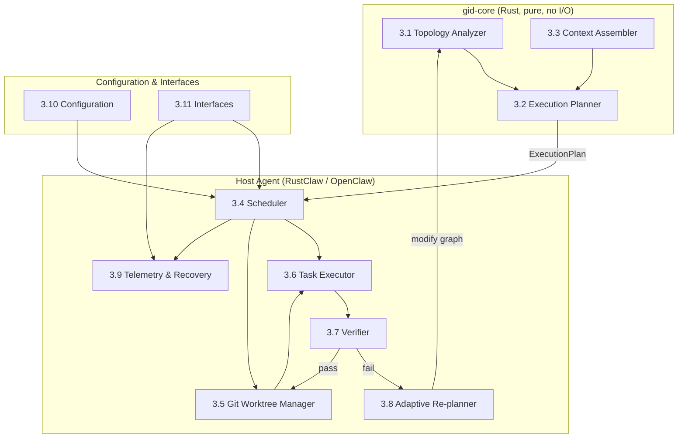
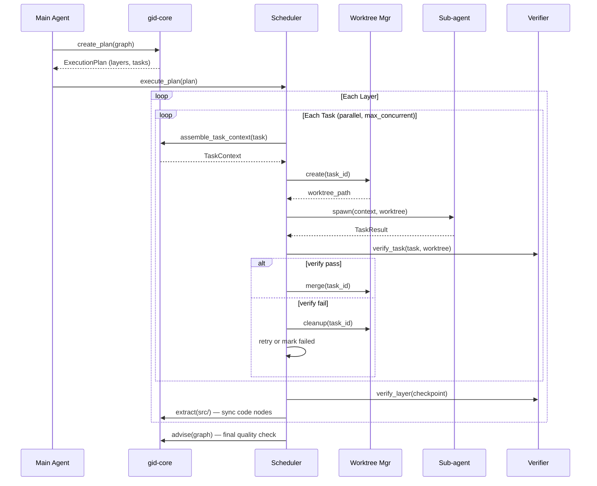
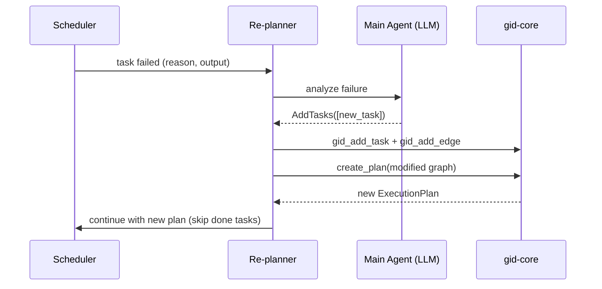
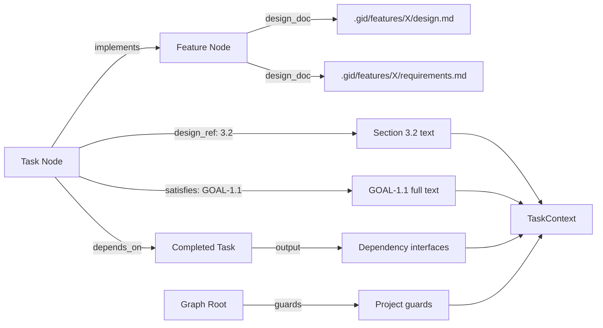

# Design: GID Task Execution Harness

## 1. Overview

A deterministic, algorithm-driven task execution engine that reads a GID graph's task topology and orchestrates sub-agents to implement them. The harness replaces LLM-based "what to do next" decisions with code-driven topological scheduling.

**Core principle:** Code does scheduling, LLM does execution.

**Architecture split:** Planning is pure Rust in gid-core (no I/O, no LLM). Execution is in the host agent framework (RustClaw/OpenClaw) which spawns sub-agents, manages worktrees, and runs verification.

**Pipeline context:** This is Phase 4-7 of the 7-phase GID pipeline:
```
Phase 1: Idea Intake       → IDEAS.md
Phase 2: Requirements       → .gid/[features/X/]requirements.md
Phase 3: Design             → .gid/[features/X/]design.md
Phase 4: Graph Generation   → .gid/graph.yml (gid_design)
Phase 5: Execution Planning → ExecutionPlan (create_plan())
Phase 6: Task Execution     → code in worktrees (harness runner)
Phase 7: Verification       → merged to main (verify + checkpoint + extract + advise)
```

Phase 1-3 are collaborative (human + agent). Phase 4 is hybrid (LLM generates, code validates). Phase 5-7 are code-driven.

**Key trade-offs:**
- Determinism over flexibility: topology sort decides execution order, not LLM judgment
- Isolation over efficiency: git worktrees per task add overhead but prevent conflicts
- Front-loaded context over runtime extraction: rich task descriptions at graph creation time, not LLM file-reading at execution time

## 2. Architecture



**Why this split:**
- gid-core is testable, portable, and deterministic — usable from any consumer
- Host agent handles I/O: spawning sub-agents, git operations, file system, API calls
- Interfaces are read-only consumers of shared file state (no server process)

## 3. Components

### 3.1 Topology Analyzer

**Responsibility:** Validate graph structure and compute execution layers from dependency DAG.

**Interface:**
```rust
/// Detect all cycles in the graph. Returns empty vec if acyclic.
pub fn detect_cycles(graph: &Graph) -> Vec<Vec<String>>;

/// Group tasks into parallelizable layers via topological sort.
/// Layer N depends only on layers 0..N-1.
/// Tasks enter the earliest possible layer based on actual dependencies.
pub fn compute_layers(graph: &Graph) -> Result<Vec<Vec<String>>>;

/// Find the longest dependency chain (critical path).
pub fn critical_path(graph: &Graph) -> Vec<String>;

/// Find tasks with no incoming or outgoing edges.
pub fn orphan_tasks(graph: &Graph) -> Vec<String>;
```

**Key Details:**
- Uses Kahn's algorithm: initialize in-degree map, BFS from zero-degree nodes, group by depth
- Cycle detection runs first — if cycles found, reject with full cycle path details
- Orphan tasks are warned but not rejected (they execute in layer 0)
- Layer assignment is deterministic: same graph always produces same layers (sorted by node ID within each layer for stability)
- Pure function — no I/O, no side effects

**Satisfies:** GOAL-1.1, GOAL-1.2, GOAL-1.3, GOAL-1.4

### 3.2 Execution Planner

**Responsibility:** Generate an ExecutionPlan from the graph's topology and task metadata.

**Interface:**
```rust
/// Generate execution plan from graph. Pure function.
pub fn create_plan(graph: &Graph) -> Result<ExecutionPlan>;

pub struct ExecutionPlan {
    pub layers: Vec<ExecutionLayer>,
    pub critical_path: Vec<String>,
    pub total_tasks: usize,
    pub estimated_total_turns: u32,
}

pub struct ExecutionLayer {
    pub index: usize,
    pub tasks: Vec<TaskInfo>,
    pub checkpoint: Option<String>,  // verification command after layer completes
}

pub struct TaskInfo {
    pub id: String,
    pub title: String,
    pub description: String,
    pub goals: Vec<String>,          // from feature node's metadata.goals
    pub verify: Option<String>,      // from metadata.verify
    pub estimated_turns: u32,        // from metadata.estimated_turns (default: 15)
    pub depends_on: Vec<String>,
}
```

**Key Details:**
- Calls `compute_layers()` from §3.1, then enriches each task with metadata from graph nodes
- Idempotent: calling N times on same graph produces identical plan (GUARD-1)
- `checkpoint` defaults to language-appropriate command (`cargo check`, `npm test`, `pytest`) — auto-detected from project files, overridable in `.gid/execution.yml`
- `estimated_turns` defaults to 15 if not specified in metadata
- `create_plan()` on a graph with completed tasks skips them — only pending tasks appear in plan

**Satisfies:** GOAL-1.5, GOAL-1.6, GOAL-1.7

### 3.3 Context Assembler

**Responsibility:** Build minimal, precise context for each sub-agent by resolving graph metadata to actual file content.

**Interface:**
```rust
/// Assemble context for a task. Resolves docs via feature node.
/// Pure function except for file reads (design.md, requirements.md).
pub fn assemble_task_context(
    graph: &Graph,
    task_id: &str,
    gid_root: &Path,           // .gid/ directory
) -> Result<TaskContext>;

pub struct TaskContext {
    pub task_info: TaskInfo,
    pub goals_text: Vec<String>,           // resolved GOAL text from requirements.md
    pub design_excerpt: Option<String>,    // extracted section from design.md
    pub dependency_interfaces: Vec<String>, // outputs from completed depends_on tasks
    pub guards: Vec<String>,               // project-level guards from graph root
}
```

**Key Details:**

**Feature doc resolution:**
1. Find task's `implements` edge → get feature node
2. Feature node's `metadata.design_doc: "task-harness"` → `.gid/features/task-harness/design.md` + `requirements.md`
3. If no `design_doc` → fallback to `.gid/design.md` and `.gid/requirements.md`

**Design reference extraction** (`design_ref: "3.2"`):
1. Read design.md, parse markdown headings
2. Find heading matching section ref (pattern: heading starts with "3.2" as number prefix)
3. Capture all text from that heading until next heading of same or higher level
4. Edge cases: "3" captures all subsections; missing section → None + warning; multiple matches → first match

**Satisfies resolution** (`satisfies: ["GOAL-1.1"]`):
1. Read requirements.md from resolved feature path
2. Find lines matching each GOAL ID
3. Return full goal text

**Guards injection:**
- All guards from graph root `metadata.guards` are included in every task context
- These become constraints in the sub-agent prompt

**Context size target:** 500-2000 tokens per task (vs 20K+ for full workspace loading).

Context assembly is deterministic — same graph + same files always produces same TaskContext (GUARD-2). No LLM calls in this path.

**Satisfies:** GOAL-1.8, GOAL-1.9, GOAL-1.10, GOAL-1.11, GOAL-1.12, GOAL-1.13, GOAL-1.14, GOAL-1.15, GOAL-1.18, GOAL-1.19

### 3.4 Scheduler

**Responsibility:** Drive execution of the plan — manage task states, enforce dependencies, control parallelism.

**Interface:**
```rust
/// Execute a plan. Drives the full lifecycle.
pub async fn execute_plan(
    plan: &ExecutionPlan,
    graph: &mut Graph,
    config: &HarnessConfig,
    executor: &dyn TaskExecutor,    // injected: spawns sub-agents
    worktree_mgr: &dyn WorktreeManager,
) -> Result<ExecutionResult>;

pub struct ExecutionResult {
    pub tasks_completed: usize,
    pub tasks_failed: usize,
    pub total_turns: u32,
    pub total_tokens: u64,
    pub duration: Duration,
}
```

**Key Details:**
- Processes layers sequentially; within each layer, spawns tasks in parallel up to `max_concurrent` (default 3)
- Only schedules tasks whose `depends_on` are all `done`
- Rate limit handling: on 429, pause all new spawns, wait for cooldown, then resume
- Eager scheduling (P2): can start next-layer tasks when their specific deps complete, not waiting for full layer
- After each task completes, persists state to `graph.yml`
- Between layers: runs checkpoint command on main branch before proceeding
- Task state machine: `todo` → `in_progress` → `done` | `failed` | `needs_resolution` | `blocked`
  - `failed` → `todo` (retry, up to `max_retries`)
  - `failed` → `blocked` (retries exhausted; dependents also marked `blocked`)
  - `needs_resolution` → `todo` (after re-planning)

**Post-layer Code Graph Synchronization:**

After all tasks in a layer merge to main and the layer checkpoint passes, the scheduler runs `gid extract` on the project source directory to update the code graph:

```rust
/// Run after each layer completes to sync code nodes with graph.
async fn post_layer_extract(
    graph: &mut Graph,
    project_root: &Path,
) -> Result<()> {
    let code_graph = CodeGraph::extract_from_dir(project_root);
    let unified = build_unified_graph(&code_graph, graph);
    // Merge code nodes into graph, preserving all semantic nodes
    // (feature, task, component). Uses file path as dedup key.
    *graph = unified;
    save_graph(graph)?;
    Ok(())
}
```

This ensures that subsequent layers can reference code nodes created by earlier layers. Extract merges code nodes (file, class, function) into the existing graph while preserving all semantic nodes (feature, task). File path serves as the deduplication key — re-extracting the same file updates the existing node.

**Post-execution Quality Check:**

After all layers complete, the scheduler runs `gid advise` as a final graph quality check. The advise result is logged to telemetry but does **not** block or revert completed work — it serves as an informational quality gate.

```rust
async fn post_execution_advise(graph: &Graph) -> AdviseResult {
    let result = advise_analyze(graph);
    telemetry.log_event(&ExecutionEvent::Advise {
        passed: result.passed,
        score: result.score,
        issues: result.items.len(),
        timestamp: Utc::now(),
    }).ok();
    result
}
```

**Satisfies:** GOAL-2.1, GOAL-2.2, GOAL-2.3, GOAL-2.4, GOAL-2.13, GOAL-2.16, GOAL-2.17, GOAL-2.18, GOAL-2.19, GOAL-2.20, GOAL-2.21, GOAL-2.22

### 3.5 Git Worktree Manager

**Responsibility:** Create, merge, and clean up isolated git worktrees for parallel sub-agent execution.

**Interface:**
```rust
pub trait WorktreeManager {
    /// Create worktree branched from latest main.
    /// Returns path to worktree directory.
    fn create(&self, task_id: &str) -> Result<PathBuf>;

    /// Rebase worktree on latest main, then merge with --no-ff.
    /// Returns Ok if clean, Err(MergeConflict) if conflicts.
    fn merge(&self, task_id: &str) -> Result<()>;

    /// Remove worktree and delete branch.
    fn cleanup(&self, task_id: &str) -> Result<()>;

    /// List surviving worktrees (for crash recovery).
    fn list_existing(&self) -> Result<Vec<WorktreeInfo>>;
}

pub struct WorktreeInfo {
    pub task_id: String,
    pub path: PathBuf,
    pub branch: String,     // gid/task-{id}
}
```

**Key Details:**
- Worktrees created in temporary directory, branched from latest main: `git worktree add /tmp/gid-wt-{task_id} -b gid/task-{task_id}`
- Merges are serialized within a layer (mutex) — no two merges to main happen concurrently (GUARD-11)
- Merge flow: `git rebase main` in worktree → if clean, `git merge --no-ff gid/task-{id}` on main → cleanup
- Rebase conflict → task marked `needs_resolution`, execution paused
- Failed verification → worktree discarded without merging (natural rollback)
- Sequential tasks (single dependency chain) skip worktree, run directly on main
- Cleanup after cancel: worktrees preserved by default; `gid execute --cleanup` removes all

**Satisfies:** GOAL-2.5, GOAL-2.6, GOAL-2.7, GOAL-2.8, GOAL-2.9, GOAL-2.10, GOAL-2.11, GOAL-2.12

### 3.6 Task Executor

**Responsibility:** Spawn sub-agents with assembled context and collect results.

**Interface:**
```rust
pub trait TaskExecutor {
    /// Spawn a sub-agent for a task in the given worktree.
    async fn spawn(
        &self,
        context: &TaskContext,
        worktree_path: &Path,
        config: &HarnessConfig,
    ) -> Result<TaskResult>;
}

pub struct TaskResult {
    pub success: bool,
    pub output: String,          // sub-agent's final message
    pub turns_used: u32,
    pub tokens_used: u64,
    pub blocker: Option<String>, // if sub-agent reported a blocker
}
```

**Key Details:**

**Sub-agent system prompt** (focused, no workspace files):
```
You are a focused coding agent executing a single task.

## Your Task
{task.title}

## Description
{task.description}

## Goals
{goals_text, one per line}

## Design Context
{design_excerpt}

## Project Guards (must never be violated)
{guards, one per line}

## Verify Command
{task.verify}

## Rules
1. Stay focused — only implement what's described above
2. Be efficient — write code directly, don't read files unless needed
3. Don't modify .gid/ — graph is managed by the harness
4. Self-test — run the verify command yourself before finishing
5. Report blockers — if you can't complete due to missing dependency, say so clearly

## Available Tools
read_file, write_file, edit_file, exec

## Workspace
Git worktree at: {worktree_path}
```

- **NOT included:** SOUL.md, AGENTS.md, USER.md, MEMORY.md, IDENTITY.md, engram, web_search, message tools, GID tools. Saves ~20K tokens per session.
- Max iterations: configurable (default 80)
- On retry: enhanced prompt includes previous failure output and guidance
- No output from sub-agent → retry once with enhanced prompt before marking failed
- Sub-agent blocker reports are captured in `TaskResult.blocker` and fed to re-planner

**Satisfies:** GOAL-2.14, GOAL-2.15, GOAL-2.23, GOAL-2.24, GOAL-2.25, GOAL-2.26, GOAL-2.27

### 3.7 Verifier

**Responsibility:** Run verification commands at task and layer level to ensure correctness.

**Interface:**
```rust
pub struct Verifier {
    pub default_checkpoint: Option<String>,  // from config
}

impl Verifier {
    /// Run task's verify command in its worktree.
    pub fn verify_task(&self, task: &TaskInfo, worktree: &Path) -> Result<VerifyResult>;

    /// Run layer checkpoint on main branch after all merges.
    pub fn verify_layer(&self, layer: &ExecutionLayer) -> Result<VerifyResult>;

    /// Run guard checks defined in execution.yml.
    pub fn verify_guards(&self, checks: &[GuardCheck]) -> Result<Vec<GuardResult>>;
}

pub struct GuardCheck {
    pub guard_id: String,       // e.g., "GUARD-1"
    pub command: String,        // e.g., "grep -rn 'fs::write' src/ | grep -v atomic | wc -l"
    pub expected: String,       // e.g., "0"
}

pub enum VerifyResult {
    Pass,
    Fail { output: String, exit_code: i32 },
}
```

**Key Details:**
- Per-task verify: runs `metadata.verify` in worktree before merging. Fail → discard worktree.
- Layer checkpoint: runs after all layer tasks merge to main. Default: auto-detected (`cargo check`, `npm test`, `pytest`). Custom: from `.gid/execution.yml`.
- Guard checks: defined in `execution.yml` `invariant_checks` section. Each guard maps to a command + expected output. Guards without explicit checks serve as documentation constraints in sub-agent prompts.
- Checkpoint schedule: per-task verify → merge → layer checkpoint (includes guard checks) → next layer

**Satisfies:** GOAL-2.18, GOAL-2.19, GOAL-2.20, GOAL-2.21, GOAL-2.22

### 3.8 Adaptive Re-planner

**Responsibility:** Analyze task failures and modify the graph to recover execution.

**Interface:**
```rust
pub struct Replanner {
    pub max_replans: u32,       // default 3
    pub replan_count: u32,      // current count
}

impl Replanner {
    /// Analyze failure and decide action.
    /// Returns the LLM's decision (the main agent, not sub-agent, makes this call).
    pub fn analyze_failure(
        &self,
        task: &TaskInfo,
        result: &TaskResult,
    ) -> ReplanDecision;
}

pub enum ReplanDecision {
    Retry,                          // simple failure, try again
    AddTasks(Vec<NewTask>),         // structural issue, add missing tasks
    Escalate(String),               // can't resolve, notify human
}

pub struct NewTask {
    pub id: String,
    pub title: String,
    pub description: String,
    pub depends_on: Vec<String>,
    pub metadata: HashMap<String, Value>,
}
```

**Key Details:**
- **LLM decides, code executes:** The main agent (not sub-agent) analyzes failures and decides whether to retry, add tasks, or escalate
- Simple failures (timeout, flaky test) → retry same task
- Structural failures (missing dependency, wrong interface) → add new tasks via `gid_add_task` + `gid_add_edge`, then re-run `create_plan()`
- Re-planning skips already-completed tasks — only new/remaining tasks scheduled
- Max re-plans exceeded → pause execution, escalate to human
- All re-plan events logged in telemetry

**Satisfies:** GOAL-3.1, GOAL-3.2, GOAL-3.3, GOAL-3.4, GOAL-3.5, GOAL-3.6, GOAL-3.7, GOAL-3.8, GOAL-3.9

### 3.9 Telemetry & Recovery

**Responsibility:** Log execution events, provide statistics, and enable crash recovery.

**Interface:**
```rust
pub struct TelemetryLogger {
    pub log_path: PathBuf,      // .gid/execution-log.jsonl
}

impl TelemetryLogger {
    pub fn log_event(&self, event: &ExecutionEvent) -> Result<()>;
    pub fn compute_stats(&self) -> Result<ExecutionStats>;
}

pub enum ExecutionEvent {
    Plan { total_tasks: usize, layers: usize, timestamp: DateTime<Utc> },
    TaskStart { task_id: String, layer: usize, timestamp: DateTime<Utc> },
    TaskDone { task_id: String, turns: u32, tokens: u64, duration_s: u64, verify: VerifyResult, timestamp: DateTime<Utc> },
    TaskFailed { task_id: String, reason: String, turns: u32, timestamp: DateTime<Utc> },
    Checkpoint { layer: usize, command: String, result: VerifyResult, timestamp: DateTime<Utc> },
    Replan { new_tasks: Vec<String>, new_edges: Vec<(String, String)>, timestamp: DateTime<Utc> },
    Cancel { tasks_done: usize, tasks_remaining: usize, timestamp: DateTime<Utc> },
    Complete { total_turns: u32, total_tokens: u64, duration_s: u64, failed: usize, timestamp: DateTime<Utc> },
}

pub struct ExecutionStats {
    pub tasks_completed: usize,
    pub tasks_failed: usize,
    pub total_turns: u32,
    pub avg_turns_per_task: f32,
    pub total_tokens: u64,
    pub duration: Duration,
    pub estimation_accuracy: f32,  // % of tasks within estimated_turns
}
```

**Key Details:**

**Telemetry:** Append-only JSONL format. No data loss on crash (GUARD-8). Example:
```jsonl
{"ts":"2026-04-01T20:30:00Z","event":"plan","total_tasks":8,"layers":3}
{"ts":"2026-04-01T20:30:05Z","event":"task_start","task":"scaffold","layer":0}
{"ts":"2026-04-01T20:31:20Z","event":"task_done","task":"scaffold","turns":8,"tokens":12000,"duration_s":75,"verify":"pass"}
```

**Crash recovery:**
1. Graph state (`.gid/graph.yml`) is source of truth — tasks marked `done` are skipped
2. Surviving worktrees inspected: verify passes → merge + mark done; verify fails → discard + reset to `todo`
3. `gid execute` is idempotent — running again after crash resumes correctly (GUARD-7)

**Cancellation:**
1. Signal running sub-agents to stop (graceful with timeout)
2. In-progress tasks reset to `todo` (not `failed`)
3. Worktrees preserved for inspection; `gid execute --cleanup` removes them
4. Cancellation event logged in telemetry

**Statistics:** `gid stats` reads execution-log.jsonl and computes summary (no external DB needed).

**Satisfies:** GOAL-4.1, GOAL-4.2, GOAL-4.3, GOAL-4.4, GOAL-4.5, GOAL-4.6, GOAL-4.7, GOAL-4.8, GOAL-4.9, GOAL-4.10, GOAL-4.11, GOAL-4.12, GOAL-4.13

### 3.10 Configuration

**Responsibility:** Manage harness settings with cascading precedence.

**Interface:**
```rust
pub struct HarnessConfig {
    pub approval_mode: ApprovalMode,  // mixed | manual | auto
    pub max_concurrent: usize,        // default 3
    pub max_retries: u32,             // default 1
    pub max_replans: u32,             // default 3
    pub default_checkpoint: Option<String>,
    pub model: String,                // default model for sub-agents
}

pub enum ApprovalMode {
    Mixed,    // Phase 1-3 pause, Phase 4-7 auto
    Manual,   // all phases pause
    Auto,     // Phase 1-3 collaborative, Phase 4-7 auto
}

impl HarnessConfig {
    /// Load with cascading precedence: CLI > graph-level > framework > defaults
    pub fn load(
        cli_overrides: &CliArgs,
        execution_yml: Option<&Path>,     // .gid/execution.yml
        framework_config: Option<&Path>,  // rustclaw.yaml or openclaw config
    ) -> Result<HarnessConfig>;
}
```

**Key Details:**

**`.gid/execution.yml`** (project-level):
```yaml
approval_mode: mixed
max_concurrent: 3
max_retries: 1
max_replans: 3
default_checkpoint: "cargo check && cargo test"
model: claude-sonnet-4-5

invariant_checks:
  GUARD-1:
    command: "grep -rn 'fs::write' src/ | grep -v atomic | wc -l"
    expect: "0"
```

**Precedence:** CLI flag > `.gid/execution.yml` > framework config (`rustclaw.yaml`) > built-in defaults.

**Approval modes:**
| Mode | Phase 1-3 | Phase 4-7 |
|------|-----------|-----------|
| `mixed` (default) | Pause for approval | Auto-execute |
| `manual` | Pause for approval | Pause for approval |
| `auto` | Collaborative (no gate) | Auto-execute |

**Adaptive scheduling (future):**
- Execution history feeds into `estimated_turns` improvement (GOAL-5.1)
- Agent recalls Engram experiences before `gid_design` for task sizing (GOAL-5.2)
- After execution, learnings stored in Engram (GOAL-5.3)
- Model routing: simple tasks → Sonnet, complex → Opus based on history (GOAL-5.5)
- `gid plan --cost` estimates total cost from estimated_turns + model pricing (GOAL-5.6)

These are prompt-level first (teach agent to recall/store), code-level deferred.

**Satisfies:** GOAL-5.1, GOAL-5.2, GOAL-5.3, GOAL-5.4, GOAL-5.5, GOAL-5.6, GOAL-5.7, GOAL-5.8, GOAL-6.4, GOAL-6.5, GOAL-6.6, GOAL-6.7

### 3.11 Interfaces

**Responsibility:** Provide CLI, MCP, and multi-surface access to the harness.

**Interface:**

**CLI commands:**
```
gid plan [--format json|text]              # show execution plan
gid execute [--max-concurrent N] [--model M] [--approval-mode MODE]
gid execute --cancel                       # stop mid-execution
gid execute --cleanup                      # remove worktrees
gid stats                                  # execution history
gid approve <task-id>                      # manual approval
gid stop                                   # halt execution
```

**MCP tool (`gid_plan`):**
```json
{
  "layers": [
    {"layer": 0, "tasks": ["scaffold", "cargo-init"], "parallel": true},
    {"layer": 1, "tasks": ["config-module"], "parallel": false}
  ],
  "total_tasks": 5,
  "estimated_total_turns": 75,
  "critical_path": ["scaffold", "config-module", "auth-module"]
}
```

**RustClaw integration:** Calls gid-core API directly (no MCP overhead). Uses `spawn_agent_with_options()` for sub-agents.

**Key Details:**

**Multi-surface architecture:** All surfaces share the same file backend — no server process:
```
Telegram ──┐
gidterm  ──┤──→ .gid/graph.yml (state)
CLI      ──┘    .gid/execution-log.jsonl (events)
                .gid/execution-state.json (run state + commands)
```

- **Read:** surfaces watch execution-log.jsonl for events
- **Write:** surfaces write commands to execution-state.json (approve, stop, steer)
- Engine picks up changes on next scheduling cycle

**gidterm** is a pure UI/presentation layer:
- Reads execution-log.jsonl via file watch, renders TUI (DAG view, task status, live logs)
- User actions → writes to execution-state.json
- gidterm's existing executor/scheduler/PTY backend is NOT used by the harness

**Phase-level approval gates** (in `mixed`/`manual` mode):
- After Phase 2: "Requirements written with N goals. Review and confirm."
- After Phase 3: "Design complete. Review and confirm."
- After Phase 4: "Graph: N tasks in M layers. Confirm to start execution."

**Failure escalation tiers:**
1. Auto-retry (simple failures, up to max_retries)
2. Re-plan (structural issues, agent modifies graph)
3. Escalate to human (unresolvable, notify via Telegram/CLI)

**Satisfies:** GOAL-6.1, GOAL-6.2, GOAL-6.3, GOAL-6.8, GOAL-6.9, GOAL-6.10, GOAL-6.11, GOAL-6.12, GOAL-6.13, GOAL-6.14, GOAL-6.15, GOAL-6.16, GOAL-6.17, GOAL-6.18, GOAL-6.19

### 3.12 Skills & Graph Generation Prompt

**Responsibility:** Provide templates for Phase 1-3 outputs and configure the `gid_design` prompt for Phase 4 graph generation.

**Artifacts:**
- `skills/requirements/SKILL.md` — GOAL/GUARD format template, priority/severity, self-review checklist
- `skills/design-doc/SKILL.md` — 8-section design template, numbered sections, interface signatures
- `skills/idea-intake/SKILL.md` — Phase 1 idea capture workflow

**`gid_design` prompt update** (in `crates/gid-core/src/design.rs`):
The prompt must instruct the LLM to generate:
- Feature nodes with `metadata.goals` arrays (GOAL-X.Y format)
- Task nodes with `satisfies`, `design_ref`, `verify`, `estimated_turns` metadata
- Rich self-contained descriptions: interface signatures, data structures, constraints, connection points
- Task sizing: 5-25 `estimated_turns` per task
- Feature nodes with `design_doc` metadata when multi-feature

**Agent orchestration:** RustClaw system prompt should include guidance to:
- Run `engram recall "{project} task sizing"` before `gid_design`
- Store execution learnings in Engram after completion

**Satisfies:** GOAL-7.1, GOAL-7.2, GOAL-7.3, GOAL-7.4, GOAL-7.5, GOAL-7.6, GOAL-7.7, GOAL-7.8

## 4. Data Models

### Graph Schema Extensions

**Feature nodes:**
```yaml
- id: auth-feature
  type: feature
  metadata:
    design_doc: "auth"                    # → .gid/features/auth/{design,requirements}.md
    goals:
      - "GOAL-1: Can list all auth profiles with status"
      - "GOAL-2: Can switch active profile"
```

**Task nodes:**
```yaml
- id: auth-read-profiles
  type: task
  status: todo                            # todo | in_progress | done | failed | needs_resolution | blocked
  title: "Implement read_profiles()"
  description: |
    Create src/auth.rs with read_profiles() function.
    Interface: fn read_profiles(path: &Path) -> Result<Vec<AuthProfile>>
    AuthProfile { name: String, token_prefix: String, status: ProfileStatus }
    Must handle: file not found (create default), invalid JSON (error with path)
  metadata:
    satisfies: ["GOAL-1.1", "GOAL-1.2"]  # → resolved from feature's requirements.md
    design_ref: "3.2"                     # → extracted from feature's design.md
    verify: "cargo test --test auth_test" # → runs after task completes
    estimated_turns: 15                   # → 5-25 range, default 15
  edges:
    - to: auth-feature
      relation: implements
    - to: config-module
      relation: depends_on
```

**Graph root guards:**
```yaml
metadata:
  guards:
    - "GUARD-1: All file writes are atomic (write to temp + rename)"
    - "GUARD-2: Auth tokens never logged in plaintext"
```

### Task State Machine

```
todo → in_progress → done
                   → failed → todo (retry)
                            → blocked (retries exhausted; dependents also blocked)
                            → needs_resolution (merge conflict)
needs_resolution → todo (after re-planning)
```

State transitions are monotonic in normal flow — `done` never reverts to `todo` unless explicitly reset by re-planning (GUARD-6).

**Satisfies:** GOAL-1.14, GOAL-1.15, GOAL-1.16, GOAL-1.17, GOAL-1.18, GOAL-1.19, GOAL-1.20

## 5. Data Flow

### Execution Flow



### Adaptive Re-planning Flow



### Context Assembly Flow



## 6. Error Handling

| Scenario | Action |
|----------|--------|
| Cyclic graph | Reject before execution, report cycle path |
| Sub-agent exceeds max_turns | Mark `failed`, discard worktree, log partial output |
| Verify command fails | Mark `failed`, discard worktree, report error |
| Merge conflict | Mark `needs_resolution`, pause, report |
| Rebase conflict | Mark `needs_resolution`, pause, report |
| All retries exhausted | Mark `blocked`, block all dependents |
| API rate limit (429) | Pause all spawning, wait for cooldown, resume |
| Sub-agent produces no output | Retry once with enhanced prompt |
| Sub-agent reports blocker | Capture blocker, feed to re-planner |
| Re-plan limit exceeded | Pause execution, escalate to human |
| Crash mid-execution | Resume from graph state + surviving worktrees |
| Missing design section | `design_excerpt = None`, log warning, sub-agent uses description only |
| Missing requirements.md | `goals_text = []`, log warning |

**Error propagation:** All errors are `Result<T, HarnessError>`. Sub-agent failures are data (captured in `TaskResult`), not panics. Only graph-level errors (cycles, missing nodes) are fatal.

## 7. Testing & Verification

**Per-component verification:**

| Component | Verify Command | What It Checks |
|-----------|---------------|----------------|
| 3.1 Topology Analyzer | `cargo test --test topology` | Cycle detection, layer grouping, critical path, orphans |
| 3.2 Execution Planner | `cargo test --test planner` | Plan generation, idempotency, checkpoint defaults |
| 3.3 Context Assembler | `cargo test --test context` | Feature doc resolution, design_ref extraction, satisfies resolution, guards |
| 3.4 Scheduler | `cargo test --test scheduler` | Parallel execution, state transitions, rate limit handling |
| 3.5 Worktree Manager | `cargo test --test worktree` | Create, merge, rebase, conflict detection, cleanup |
| 3.6 Task Executor | `cargo test --test executor` | Prompt building, result parsing, retry logic |
| 3.7 Verifier | `cargo test --test verifier` | Task verify, layer checkpoint, guard checks |
| 3.8 Re-planner | `cargo test --test replanner` | Failure analysis, graph modification, limits |
| 3.9 Telemetry | `cargo test --test telemetry` | Event logging, stats, crash recovery |
| 3.10 Configuration | `cargo test --test config` | Cascading precedence, approval modes |
| 3.11 Interfaces | `cargo test --test cli` | CLI commands, MCP response format |

**Layer checkpoint:** `cargo check && cargo test`

**Guard checks (in `.gid/execution.yml` or test suite):**

| Guard | Check |
|-------|-------|
| GUARD-1 (deterministic plan) | Run `create_plan` twice on same graph, assert identical output |
| GUARD-2 (deterministic context) | Run `assemble_task_context` twice, assert identical output |
| GUARD-3 (valid order) | For each task in plan, verify all depends_on are in earlier layers |
| GUARD-4 (cycles rejected) | Feed cyclic graph to `create_plan`, assert error with cycle path |
| GUARD-5 (graph.yml is truth) | After each state change, read graph.yml back and verify consistency |
| GUARD-6 (monotonic state) | Assert `done` tasks never appear in re-plan's pending list |
| GUARD-7 (idempotent execute) | Run `gid execute` on completed graph, assert no side effects |
| GUARD-8 (no crash data loss) | Kill mid-execution, verify execution-log.jsonl has all events up to kill |
| GUARD-9 (failed never merges) | Simulate verify failure, assert main branch unchanged |
| GUARD-10 (conflicts pause) | Create conflicting worktrees, assert `needs_resolution` state |
| GUARD-11 (serial merges) | Spawn parallel merges, assert sequential (via timestamps) |
| GUARD-12 (no workspace files) | Inspect sub-agent prompt, assert no SOUL/AGENTS/USER/MEMORY |
| GUARD-13 (worktree isolation) | Run parallel tasks, assert no file write conflicts |
| GUARD-14 (.gid/ read-only) | Sub-agent attempts `.gid/` write, assert blocked by rules |
| GUARD-15 (guards injected) | Inspect TaskContext for every task, assert guards present |
| GUARD-16 (guards not violated) | After layer checkpoint, run all invariant_checks |
| GUARD-17 (telemetry complete) | After execution, assert every task has start+done/failed events |
| GUARD-18 (replan logged) | After re-plan, assert replan event in execution-log.jsonl |

## 8. File Structure

```
crates/gid-core/src/
├── lib.rs                    # public API
├── harness.rs                # 3.1 Topology Analyzer + 3.2 Execution Planner
├── context.rs                # 3.3 Context Assembler
├── design_ref.rs             # Design reference extraction (used by 3.3)
├── plan.rs                   # ExecutionPlan, ExecutionLayer, TaskInfo structs
├── config.rs                 # 3.10 Configuration (HarnessConfig, ApprovalMode)
└── tests/
    ├── topology.rs
    ├── planner.rs
    ├── context.rs
    └── config.rs

# Host agent integration (RustClaw example)
src/
├── harness/
│   ├── mod.rs                # 3.4 Scheduler (execute_plan)
│   ├── executor.rs           # 3.6 Task Executor (spawn, prompt building)
│   ├── worktree.rs           # 3.5 Git Worktree Manager
│   ├── verifier.rs           # 3.7 Verifier
│   ├── replanner.rs          # 3.8 Adaptive Re-planner
│   └── telemetry.rs          # 3.9 Telemetry & Recovery
├── cli/
│   └── gid.rs                # 3.11 CLI commands (plan, execute, stats, etc.)
└── mcp/
    └── gid_plan.rs           # 3.11 MCP tool

# Runtime files
.gid/
├── graph.yml                 # Single project graph
├── execution.yml             # Harness configuration
├── execution-log.jsonl       # Append-only telemetry
├── execution-state.json      # Current run state
├── design.md                 # Simple project design
├── requirements.md           # Simple project requirements
└── features/                 # Multi-feature project
    └── {name}/
        ├── design.md
        └── requirements.md
```
